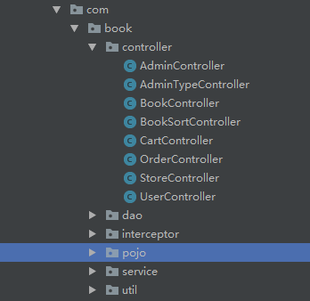

# SecondHandBookStore
基于SSM的网上二手书店————使用技术：SSM、LayUI、echarts  

## 运行环境

​		本网上二手书店是采用企业应用架构：Spring + SpringMVC + MyBatis的开发架构。网上二手书店运行环境如表所示。

| **项目**         | **说明**      |
| ---------------- | ------------- |
| **系统环境**     | Windows11     |
| **运行工具**     | IntelliJ IDEA |
| **Java版本**     | JDK 8.0       |
| **数据库**       | MySQL         |
| **服务器**       | Tomcat 9      |
| **项目管理工具** | Maven         |

## 系统功能

​		将网上二手书店分成两个子模块：二手书买卖模块和书店管理模块。二手书买卖模块包括二手书浏览模块、购物车模块、购买模块、订单模块、发布二手书模块。书店数据管理模块包括数据可视化模块、用户信息管理模块、二手书管理模块、管理员管理模块。系统总的模块图如图所示。

## 数据库结构

​		通过对网上二手书店的工作过程和数据流图分析，本系统设计如下面的数据项和数据结构，分别是：

​				(1)   管理员信息，包括的数据项有：管理员编号、管理员姓名、管理员电话、注册时间、管理员性别、管理员年龄、管理员头像、管理员权限编号。

​				(2)   管理员登录信息，包括的数据项有：管理员编号、管理员登录账号、管理员登录密码、修改时间。

​				(3)   管理员类型信息，包括的数据项有：管理员权限编号、管理员权限类型、备注。

​				(4)   二手书图片信息，包括的数据项有：二手书编号、二手书图片路径。

​				(5)   二手书信息，包括的数据项有：二手书编号、二手书名、二手书成色、二手书价格、二手书类型编号、二手书数量、作者、出版社、是否下架、二手书销售量、出售用户编号。

​				(6)   二手书类型信息，包括的数据项有：二手书类型编号、二手书类型名称、备注。

​				(7)   订单信息，包括的数据项有：订单编号、用户编号、二手书编号、订单时间。

​				(8)   购物车信息，包括的数据项有：购物车编号、用户编号、二手书编号。

​				(9)   用户信息，包括的数据项有：用户编号、用户姓名、用户电话、注册时间、用户性别、用户年龄、用户头像。

​				(10) 用户登录信息，包括的数据项有：用户编号、用户登录账号、用户登录密码。

 

3.3 数据库的逻辑结构设计

(1)   管理员信息表admininfo详细信息。

 

(2)   管理员登录信息表adminlogin详细信息。

(3)   管理员类型信息表admintype详细信息。

(4)   二手书图片信息表bookimage详细信息。

(5)   二手书信息表bookinfo详细信息。

 

(6)   二手书类型信息booksort详细信息。

(7)   订单信息表orderlist详细信息。

(8)   购物车信息表shoppingcart详细信息。

(9)   用户信息表userinfo详细信息。

(10) 用户登录信息表userlogin详细信息。

## 网上二手书店的实现

### 目录结构

​		网上二手书店的目录结构如图所示。

(1)   controller包

系统的控制器类都在该包中。

(2)   dao包

dao包中存放Java接口程序用于实现数据库的持久化操作以及对应的映射文件。每个dao的接口方法与SQL映射文件的id相对应。

(3)   interceptor包

系统的拦截器都放在该包中。

(4)   pojo包

系统的持久化类存放在该包中。

(5)   service包

service包用于存放service接口，在impl的子包当中存放service的实现类。

(6)   util包

util包存放的是系统的工具类，登录密码的MD5加密工具类就放在此包。

(7)   表示层

在网上二手书店中表示层主要由JSP页面充当，它负责收集用户的请求数据，并将数据提交到指定的控制器。当系统处理完用户请求后，JSP页面还负责将处理结果呈现给用户。本系统主要用到的JSP页面如表所示

| **界面功能**           | **JSP文件名称** |
| ---------------------- | --------------- |
| **管理员编辑界面**     | admin_edit      |
| **管理员信息界面**     | admin_info      |
| **管理员列表界面**     | admin_list      |
| **所有二手书界面**     | allbook         |
| **二手书编辑界面**     | book_edit       |
| **二手书详情界面**     | book_detail     |
| **二手书列表界面**     | book_list       |
| **管理员首页界面**     | homepage        |
| **管理员登录界面**     | login           |
| **用户订单界面**       | mylist          |
| **二手书图片添加界面** | pic_add         |
| **用户出售二手书界面** | sale_book       |
| **用户购物车界面**     | shoppingcart    |
| **图书类型编辑界面**   | sort_edit       |
| **图书类型列表界面**   | sort_list       |
| **书店首页界面**       | storepage       |
| **管理员类型编辑界面** | type_edit       |
| **管理员类型列表界面** | type_list       |
| **用户信息编辑界面**   | user_edit       |
| **用户信息列表界面**   | user_list       |
| **用户登录界面**       | userlogin       |
| **用户注册界面**       | userregister    |

## 系统实现

##### 登录模块实现

​		系统登录模块分为管理员登录、用户登录以及用户注册，系统分配管理员账号密码，用户账号密码通过注册后实现登录。当登录失败系统会显示登录失败的信息，登录成功后进入相应的界面。

- 用户登录

- 用户注册

- 管理员登录

 

##### 管理员模块实现

​		管理员模块实现如图所示。

##### 个人资料模块实现

​		当管理员点击个人资料模块展示出当前管理员的所有信息。

##### 用户信息管理模块实现

​		当管理员点击用户信息模块展示出书店所有用户的所有信息，以及可以对信息进行增加、删除、修改、查找操作。

##### 图书信息管理模块实现

​		 当管理员点击图书信息模块展示出书店所有二手书的所有信息，以及可以对信息进行增加、删除、修改、查找操作。

##### 管理员信息管理模块实现

​		当管理员点击管理员信息模块展示出书店所有管理员的所有信息，以及可以对信息进行增加、删除、修改、查找操作。

 

##### 用户模块实现

​		 用户模块实现。

##### 所有图书模块

​		 当用户点击所有图书模块展示出所有出售的二手书。

##### 图书详情模块

​		当用户点击二手书系统进入展示出所有该二手书的详细信息，并推荐类似图书。

##### 购物车模块

​		当用户点击购物车模块展示出当前用户购物车中所有的二手书。

##### 订单模块

​		当用户点击订单模块展示出当前用户的所有订单信息。

##### 出售模块

​		当用户点击出售模块展示出当前用户的所有二手书出售信息。

## 总结

​		本项目为在校期间半个月的时间完成的项目，此项目的前台页面比较简陋；二手书出售的流程当中有点小问题，需要上传图片之后才能在页面当中展示出来；图片问题的处理也没有到位。本人打算在后续的项目当中改进，我会激励自己不要摆烂的，加油！
